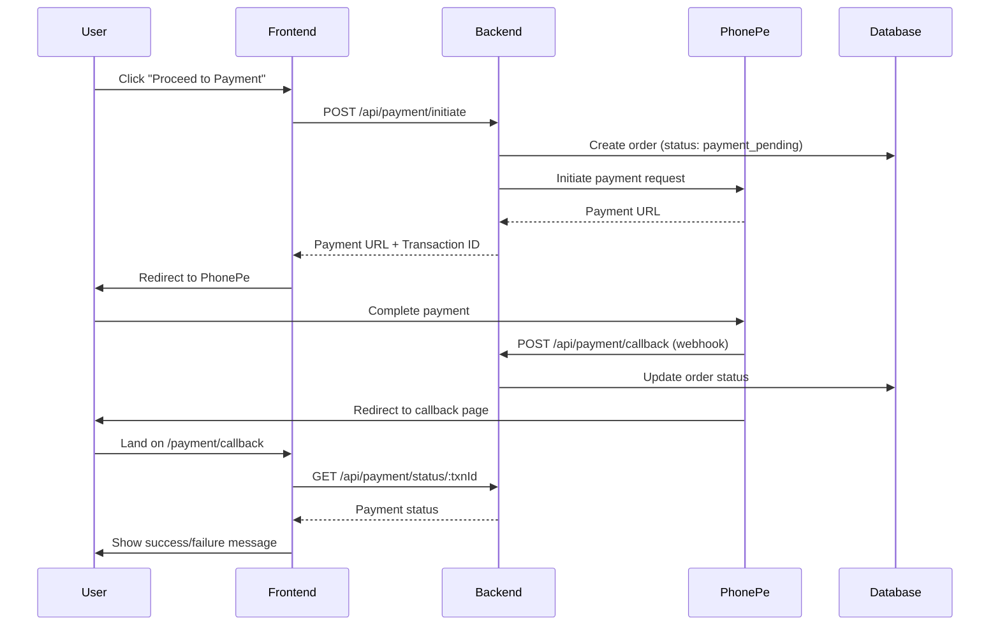

# PhonePe Payment Gateway Integration Guide

## 🎉 Integration Complete!

PhonePe payment gateway has been successfully integrated into Amma Fresh Ghee e-commerce platform.

## 📋 What's New

### Backend Changes
1. ✅ **phonePeService.js** - Complete PhonePe payment service
2. ✅ **Payment Endpoints** - Added to server.js:
   - `POST /api/payment/initiate` - Initialize payment
   - `POST /api/payment/callback` - Handle PhonePe webhook
   - `GET /api/payment/status/:transactionId` - Check payment status
3. ✅ **Database Updates** - Added payment fields to orders table:
   - `payment_transaction_id` - PhonePe transaction ID
   - `payment_status` - Payment status

### Frontend Changes
1. ✅ **Updated Checkout.vue** - Now initiates PhonePe payment
2. ✅ **New PaymentCallback.vue** - Handles payment redirect
3. ✅ **Updated api.ts** - Added PhonePe payment methods
4. ✅ **Updated App.vue** - Added payment callback routing

## 🔧 Setup Instructions

### Step 1: Configure Environment Variables

Add these to your backend `.env` file:

```env
# PhonePe Payment Gateway (Test Credentials)
PHONEPE_MERCHANT_ID=M23H2V31G7L3S_2511201935
PHONEPE_SALT_KEY=NGNmNGFmMjktMzQ1ZC00NjQ4LWFhZjYtMDk4MDQ5NzA4N2I0
PHONEPE_SALT_INDEX=1
PHONEPE_ENV=test

# Local Development URLs
PHONEPE_REDIRECT_URL=http://localhost:5173/payment/callback
PHONEPE_CALLBACK_URL=http://localhost:3000/api/payment/callback
```

### Step 2: Start the Servers

**Backend:**
```bash
cd backend
npm start
```

**Frontend:**
```bash
npm run dev
```

### Step 3: Test the Payment Flow

1. Open http://localhost:5173
2. Add products to cart
3. Click checkout
4. Fill in delivery details
5. Click "Proceed to Payment"
6. You'll be redirected to PhonePe's test payment page
7. Complete the payment (use test cards)
8. You'll be redirected back with payment status

## 🌐 Production Deployment

### Update Environment Variables for Production:

```env
# Production PhonePe Configuration
PHONEPE_MERCHANT_ID=your_production_merchant_id
PHONEPE_SALT_KEY=your_production_salt_key
PHONEPE_SALT_INDEX=1
PHONEPE_ENV=production

# Production URLs
PHONEPE_REDIRECT_URL=https://yourdomain.com/payment/callback
PHONEPE_CALLBACK_URL=https://yourbackend.com/api/payment/callback
```

### Important Notes for Production:

1. **SSL Required** - PhonePe requires HTTPS in production
2. **Callback URL** - Must be publicly accessible
3. **Webhook Verification** - All callbacks are verified with checksums
4. **Error Handling** - Comprehensive error handling is in place

## 🔄 Payment Flow



## 📊 Order Status Flow

| Status | Description | When |
|--------|-------------|------|
| `payment_pending` | Order created, awaiting payment | When payment is initiated |
| `pending` | Payment successful, order confirmed | After successful payment |
| `confirmed` | Admin confirmed the order | Admin action |
| `processing` | Order being prepared | Admin action |
| `shipped` | Order dispatched | Admin action |
| `delivered` | Order completed | Admin action |
| `payment_failed` | Payment unsuccessful | Failed payment |
| `cancelled` | Order cancelled | Admin/User action |

## 🔐 Security Features

✅ **Server-side Price Verification** - All prices verified from database  
✅ **Checksum Validation** - All PhonePe callbacks verified  
✅ **Transaction Tracking** - Unique transaction ID for each order  
✅ **SQL Injection Protection** - Parameterized queries  
✅ **XSS Protection** - Input sanitization  

## 🧪 Testing

### Test Cards (PhonePe Sandbox):

For testing in sandbox mode, PhonePe provides test cards. Check PhonePe documentation for latest test cards.

### Manual Testing Checklist:

- [ ] Payment initiation works
- [ ] Redirect to PhonePe works
- [ ] Payment completion works
- [ ] Callback handling works
- [ ] Success page displays correctly
- [ ] Failed payment shows error
- [ ] Order is created with correct status
- [ ] Cart clears on successful payment
- [ ] Notifications are sent (if configured)

## 🐛 Troubleshooting

### Payment Initiation Fails
```
Error: Failed to initiate payment
```
**Solution:** Check backend logs, verify PhonePe credentials in .env

### Callback Not Received
```
Payment status stuck on "Verifying..."
```
**Solution:** 
- For local dev: Use ngrok to expose localhost
- For production: Ensure callback URL is publicly accessible
- Check PhonePe webhook logs

### Order Not Created
```
Error: Order not found
```
**Solution:** Check database connection, verify orders table has payment columns

## 📱 PhonePe Sandbox Testing

### Using PhonePe Sandbox:

1. **API Base URL:** `https://api-preprod.phonepe.com/apis/pg-sandbox`
2. **Test Environment:** No real money transactions
3. **Test Credentials:** Use provided merchant ID and salt key
4. **Test Cards:** Check PhonePe developer documentation

## 🚀 Going Live

### Pre-Launch Checklist:

- [ ] Obtain production PhonePe merchant account
- [ ] Update production credentials in .env
- [ ] Change PHONEPE_ENV to 'production'
- [ ] Update redirect and callback URLs
- [ ] Test end-to-end in production
- [ ] Enable SSL/HTTPS
- [ ] Set up monitoring and alerts
- [ ] Test webhook delivery
- [ ] Verify email/SMS notifications
- [ ] Load test payment flow

## 📞 Support

### PhonePe Support:
- Developer Portal: https://developer.phonepe.com/
- Documentation: https://developer.phonepe.com/docs/
- Email: merchantsupport@phonepe.com

### Application Issues:
- Check backend logs: `backend/logs/` (if logging enabled)
- Review database records
- Test API endpoints with Postman/Thunder Client
- Check browser console for frontend errors

## 📝 API Reference

### POST /api/payment/initiate

**Request:**
```json
{
  "customerName": "John Doe",
  "customerPhone": "9876543210",
  "deliveryAddress": "123 Main St",
  "city": "Mumbai",
  "pincode": "400001",
  "items": [{"productId": 1, "quantity": 2}],
  "totalAmount": 649
}
```

**Response:**
```json
{
  "success": true,
  "orderNumber": "AFK1234567890",
  "paymentUrl": "https://phonepe.com/pay/...",
  "merchantTransactionId": "TXN_AFK1234567890_1234567890"
}
```

### GET /api/payment/status/:transactionId

**Response:**
```json
{
  "success": true,
  "paymentStatus": "PAYMENT_SUCCESS",
  "order": {
    "orderNumber": "AFK1234567890",
    "totalAmount": 649
  }
}
```

## 🎯 Next Steps

1. **Test thoroughly** in development
2. **Obtain production credentials** from PhonePe
3. **Update environment variables** for production
4. **Deploy to production** and test end-to-end
5. **Monitor transactions** and handle edge cases
6. **Set up automated alerts** for payment failures
7. **Document internal processes** for handling payment issues

## ✨ Features

- 💳 Secure payment processing via PhonePe
- 🔄 Real-time payment status updates
- 📱 Mobile-friendly payment interface
- ✅ Automatic order creation on payment success
- 🔔 Payment notifications (when configured)
- 🛡️ Built-in security with checksum verification
- 📊 Payment transaction tracking
- 🔁 Retry failed payments
- 📝 Comprehensive error handling

---

**Integration Date:** January 20, 2025  
**Version:** 1.0.0  
**Status:** ✅ Ready for Testing

For questions or issues, please check the troubleshooting section or contact support.

